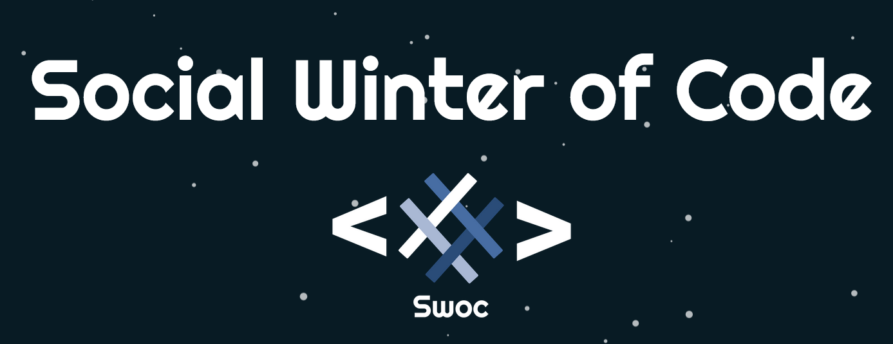
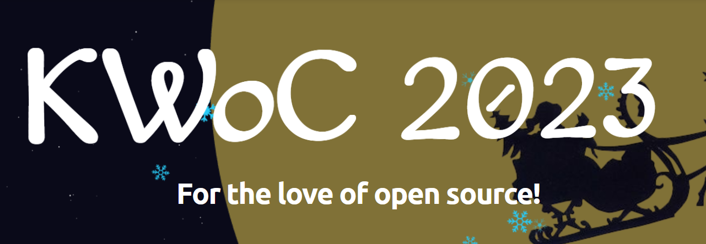
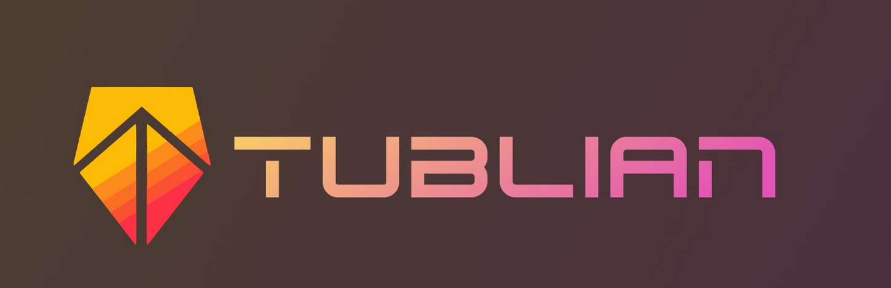
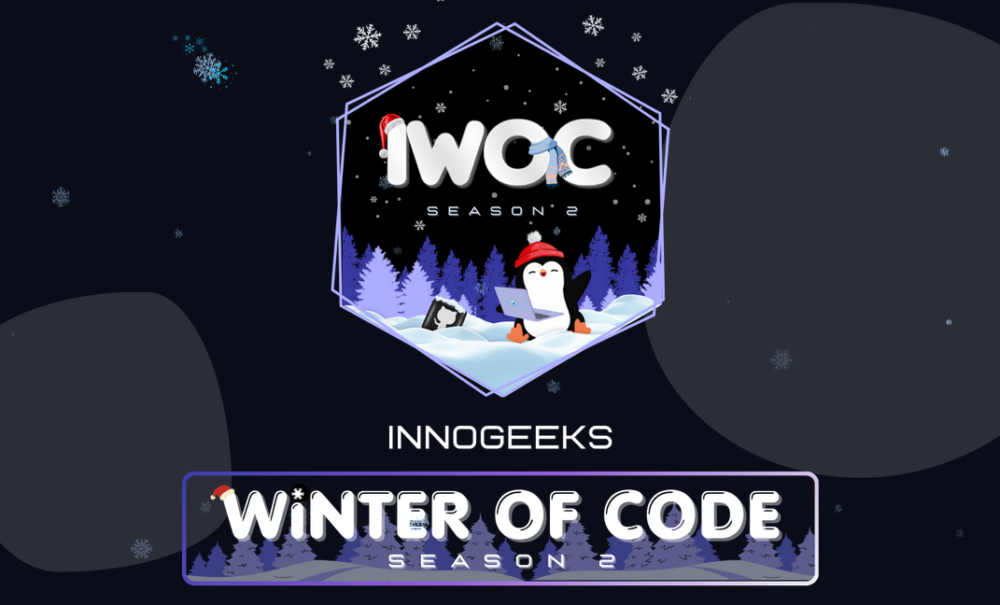

# Digitomize - [Website](https://digitomize.com)

**Digitomize**, part of **Microsoft for Startups Founders Hub**, is an open-source platform that combines two main sections: Contests and User Profiles. It allows users to explore upcoming coding contests and dynamically create developer portfolios.  

<!-- ALL-CONTRIBUTORS-BADGE:START - Do not remove or modify this section -->

<!-- ALL-CONTRIBUTORS-BADGE:END -->
Website: 

V2api: 

# Supported by:

 

  

<!--Featured In section-->
## Featured In

<table>

   <tr>
      <th>Program Logo</th>
      <th>Program Name</th>
      <th>Program Description</th>
   </tr>
   <tr>
      <td></td>
      <td><a href="https://gssoc.girlscript.tech/">GirlScript Summer of Code</a></td>
      <td>GirlScript Summer of Code is a three-month-long Open Source Program conducted every summer by GirlScript Foundation. It is an initiative to bring more beginners to Open-Source Software Development.</td>
   </tr>
   <tr>
      <td></td>
      <td><a href="https://www.socialwinterofcode.com/">Social Winter of Code</a></td>
      <td>Social Winter Of Code is the 2 month long open source program by Social India , with the aim to introduce more and more people to the world of Open source.</td>
   </tr>
   <tr>
      <td></td>
      <td><a href="https://kwoc.kossiitkgp.org/">Kharagpur Winter of Code</a></td>
      <td>Kharagpur Winter of Code is a 5-week long online program for students who are new to open source software development. The program not only helps students to get involved in open source, but also prepares them for many open source summer programs.</td>
   </tr>
   <tr>
      <td></td>
      <td><a href="https://www.tublian.com/internship">Tublian</a></td>
      <td>Tublian open source internship program lets software developers get real open source experience by collaborating with major open source projects.</td>
   </tr>
   <tr>
      <td></td>
      <td><a href="https://iwoc.codes/">Innogeeks Winter of Code</a></td>
      <td>Innogeeks Winter of Code is a month-long open-source program envisioned by the Innogeeks. It is an online initiative that introduces new contributors to open-source software development.</td>
   </tr>

</table>

## Table of Contents

- [Introduction](#introduction)
- [Features](#features)
- [Getting Started](#getting-started)
  - [Tech Stack](#tech-stack)
  - [Installation Guide](#installation-guide)
- [Usage](#usage)
  - [Contests Section](#contests-section)
  - [User Profiles](#user-profiles)
- [Contributing](#contributing)
- [License](#-license)
- [Contact Us](#contact-us)

# Introduction

**Digitomize** is designed to provide developers with a comprehensive platform for exploring coding contests and creating dynamic portfolios that showcase their coding skills and achievements.

# Features

- **Contests Section:** Explore upcoming coding contests from platforms like LeetCode, Codeforces, CodeChef, and more. Filter contests based on various criteria and view contest details such as remaining time, duration, and more.

- **User Profiles:** Create your developer portfolio by providing user handles for different coding platforms. The platform dynamically fetches and displays your updated ratings, achievements, and coding history.

# Getting Started
**Hit the star :star:**

## Tech Stack

### Frontend

- React.js
- Vite
- Tailwind (Daisyui, Material UI, Flowbite)

### Backend

- Node.js
- Express
- NPM
- MongoDB

## Installation Guide

1. Clone the repository: `git clone https://github.com/pranshugupta54/digitomize.git`
2. Install project dependencies and start the development environment:  
   In the root directory of the project (where package.json is located), run `npm install`.  
3. Configure environment variables: Create a .env file in the backend and client directories respectively, and set up the required environment variables such as database connection details, API keys, and other configurations.

- For more information check [Backend Documentation](/backend/README.md) and [Frontend Documentation](/client/README.md).

4. Start the development environment: `npm run dev` (This command, defined in your project's package.json, starts both the backend server and the client using the concurrently library. It's a convenient way to run both parts of your application concurrently during development.)

# Usage

### Contests Section

- Visit the **Contests** page to explore upcoming coding contests.
- Apply filters to narrow down contests based on your preferences.
- Click on a contest to view detailed information, including start time, duration, and platform.

### User Profiles

- Create your developer portfolio by signing up and providing your user handles for different coding platforms.
- The platform dynamically fetches and displays your latest ratings, achievements, and contest history.
- Customize your portfolio to display the information you want to share with others.

# Contributing

Contributions are welcome! Please read [CONTRIBUTING.md](CONTRIBUTING.md) for details on how to contribute to this project.

  <h1> Contributors</h1>

Thanks goes to these wonderful people ([emoji key](https://allcontributors.org/docs/en/emoji-key)):

<!-- ALL-CONTRIBUTORS-LIST:START - Do not remove or modify this section -->
<!-- prettier-ignore-start -->
<!-- markdownlint-disable -->
<table>
  <tbody>
    <tr>
      <td align="center" valign="top" width="14.28%"><a href="https://github.com/pranshugupta54"> <b>Pranshu Gupta</b></a> <a href="https://github.com/digitomize/digitomize/commits?author=pranshugupta54" title="Code">💻</a> <a href="https://github.com/digitomize/digitomize/commits?author=pranshugupta54" title="Documentation">📖</a></td>
      <td align="center" valign="top" width="14.28%"><a href="https://github.com/Saanvi26"> <b>Saanvi Lakhanpal</b></a> <a href="https://github.com/digitomize/digitomize/commits?author=Saanvi26" title="Code">💻</a></td>
      <td align="center" valign="top" width="14.28%"><a href="https://github.com/anur4ag"> <b>Anurag Sharma</b></a> <a href="https://github.com/digitomize/digitomize/commits?author=anur4ag" title="Code">💻</a></td>
      <td align="center" valign="top" width="14.28%"><a href="https://github.com/govardhan-26"> <b>GOVARDHAN RAO NAIDU BABBADI</b></a> <a href="https://github.com/digitomize/digitomize/commits?author=govardhan-26" title="Code">💻</a></td>
      <td align="center" valign="top" width="14.28%"><a href="https://github.com/PushpakRaut"> <b>Pushpak Raut</b></a> <a href="https://github.com/digitomize/digitomize/commits?author=PushpakRaut" title="Code">💻</a></td>
      <td align="center" valign="top" width="14.28%"><a href="https://github.com/MeenuyD"> <b>Meenu Yadav</b></a> <a href="https://github.com/digitomize/digitomize/commits?author=MeenuyD" title="Code">💻</a></td>
      <td align="center" valign="top" width="14.28%"><a href="https://github.com/christianfds"> <b>Christian Franchin</b></a> <a href="https://github.com/digitomize/digitomize/commits?author=christianfds" title="Code">💻</a></td>
    </tr>
    <tr>
      <td align="center" valign="top" width="14.28%"><a href="https://www.linkedin.com/in/surveer-singh-5876761b9"> <b>Surveer Singh</b></a> <a href="https://github.com/digitomize/digitomize/commits?author=hs309123" title="Code">💻</a></td>
      <td align="center" valign="top" width="14.28%"><a href="https://github.com/SauravGupta123"> <b>Saurav Gupta</b></a> <a href="https://github.com/digitomize/digitomize/commits?author=SauravGupta123" title="Code">💻</a></td>
      <td align="center" valign="top" width="14.28%"><a href="https://github.com/anmol111pal"> <b>Anmol Pal</b></a> <a href="https://github.com/digitomize/digitomize/commits?author=anmol111pal" title="Code">💻</a></td>
      <td align="center" valign="top" width="14.28%"><a href="https://github.com/xnatsuk"> <b>Louise Tona</b></a> <a href="https://github.com/digitomize/digitomize/commits?author=xnatsuk" title="Code">💻</a></td>
      <td align="center" valign="top" width="14.28%"><a href="https://github.com/HarshMakadiya"> <b>Harsh</b></a> <a href="https://github.com/digitomize/digitomize/commits?author=HarshMakadiya" title="Code">💻</a></td>
      <td align="center" valign="top" width="14.28%"><a href="https://github.com/j-mahapatra"> <b>Jagannath Mahapatra</b></a> <a href="https://github.com/digitomize/digitomize/commits?author=j-mahapatra" title="Code">💻</a></td>
      <td align="center" valign="top" width="14.28%"><a href="https://github.com/MayurShirodkarOfficial"> <b>Mayur Shirodkar</b></a> <a href="https://github.com/digitomize/digitomize/commits?author=MayurShirodkarOfficial" title="Code">💻</a></td>
    </tr>
    <tr>
      <td align="center" valign="top" width="14.28%"><a href="https://spiffy-crepe-a5d6b0.netlify.app/"> <b>Ayush Shukla</b></a> <a href="https://github.com/digitomize/digitomize/commits?author=ayusshh19" title="Code">💻</a></td>
      <td align="center" valign="top" width="14.28%"><a href="http://shresritik.web.app"> <b>Ritik Shrestha</b></a> <a href="https://github.com/digitomize/digitomize/commits?author=shresritik" title="Code">💻</a></td>
      <td align="center" valign="top" width="14.28%"><a href="https://github.com/Bishwajitpvt"> <b>Bishwajit Samanta</b></a> <a href="https://github.com/digitomize/digitomize/commits?author=Bishwajitpvt" title="Documentation">📖</a></td>
      <td align="center" valign="top" width="14.28%"><a href="https://github.com/Yash-Khattar"> <b>Yash Khattar</b></a> <a href="#design-Yash-Khattar" title="Design">🎨</a></td>
      <td align="center" valign="top" width="14.28%"><a href="https://github.com/kapilkumar9395"> <b>Kapil Kumar</b></a> <a href="https://github.com/digitomize/digitomize/commits?author=kapilkumar9395" title="Code">💻</a></td>
      <td align="center" valign="top" width="14.28%"><a href="https://github.com/DeltaCoderr"> <b>Subodh Inamdar</b></a> <a href="https://github.com/digitomize/digitomize/commits?author=DeltaCoderr" title="Code">💻</a></td>
      <td align="center" valign="top" width="14.28%"><a href="http://priyank.live"> <b>Priyankar Pal</b></a> <a href="https://github.com/digitomize/digitomize/commits?author=priyankarpal" title="Code">💻</a></td>
    </tr>
    <tr>
      <td align="center" valign="top" width="14.28%"><a href="https://portfolio-aman-three.vercel.app/"> <b>AMAN MADDHESHIYA</b></a> <a href="https://github.com/digitomize/digitomize/commits?author=inbuilt-aura" title="Code">💻</a></td>
      <td align="center" valign="top" width="14.28%"><a href="https://github.com/AlmightyNan"> <b>AlmightyNan</b></a> <a href="https://github.com/digitomize/digitomize/commits?author=AlmightyNan" title="Code">💻</a></td>
      <td align="center" valign="top" width="14.28%"><a href="http://francescomenghi.com"> <b>Francesco Menghi</b></a> <a href="https://github.com/digitomize/digitomize/commits?author=menghif" title="Code">💻</a></td>
      <td align="center" valign="top" width="14.28%"><a href="https://deeprahangdale-portfolio.vercel.app"> <b>Deep</b></a> <a href="https://github.com/digitomize/digitomize/commits?author=DeepRahangdale" title="Code">💻</a></td>
      <td align="center" valign="top" width="14.28%"><a href="https://github.com/Rushi1109"> <b>Rushi1109</b></a> <a href="https://github.com/digitomize/digitomize/commits?author=Rushi1109" title="Code">💻</a></td>
      <td align="center" valign="top" width="14.28%"><a href="https://github.com/vrun1208"> <b>Varun Patodia</b></a> <a href="https://github.com/digitomize/digitomize/commits?author=vrun1208" title="Code">💻</a></td>
      <td align="center" valign="top" width="14.28%"><a href="https://lynxsumit.vercel.app"> <b>Sumit Upadhyay</b></a> <a href="https://github.com/digitomize/digitomize/commits?author=LynxSumit" title="Code">💻</a></td>
    </tr>
    <tr>
      <td align="center" valign="top" width="14.28%"><a href="https://github.com/Khagesh2409"> <b>Khagesh Sharma</b></a> <a href="https://github.com/digitomize/digitomize/commits?author=Khagesh2409" title="Code">💻</a></td>
      <td align="center" valign="top" width="14.28%"><a href="https://github.com/manojna191"> <b>Manojna Vinjamuri</b></a> <a href="https://github.com/digitomize/digitomize/commits?author=manojna191" title="Code">💻</a></td>
      <td align="center" valign="top" width="14.28%"><a href="https://decaplanet.com"> <b>Deca</b></a> <a href="#design-decaplanet" title="Design">🎨</a></td>
      <td align="center" valign="top" width="14.28%"><a href="https://github.com/Nishantkumar012"> <b>Nishantkumar012</b></a> <a href="https://github.com/digitomize/digitomize/commits?author=Nishantkumar012" title="Code">💻</a></td>
      <td align="center" valign="top" width="14.28%"><a href="http://troncodes.com"> <b>cybertron15</b></a> <a href="https://github.com/digitomize/digitomize/commits?author=cybertron15" title="Code">💻</a></td>
      <td align="center" valign="top" width="14.28%"><a href="https://palsarthaak.wixsite.com/sarthaakpal/portfolio"> <b>sarthaak pal</b></a> <a href="#design-sarthaakpal" title="Design">🎨</a></td>
      <td align="center" valign="top" width="14.28%"><a href="https://github.com/Rushikesh0107"> <b>Rushikesh Dadas</b></a> <a href="https://github.com/digitomize/digitomize/commits?author=Rushikesh0107" title="Code">💻</a></td>
    </tr>
    <tr>
      <td align="center" valign="top" width="14.28%"><a href="https://github.com/mhgarry"> <b>Matthew Garry</b></a> <a href="https://github.com/digitomize/digitomize/commits?author=mhgarry" title="Documentation">📖</a></td>
      <td align="center" valign="top" width="14.28%"><a href="http://mukund4s.live"> <b>Mukund Solanki</b></a> <a href="https://github.com/digitomize/digitomize/commits?author=mukundsolanki" title="Code">💻</a></td>
      <td align="center" valign="top" width="14.28%"><a href="https://github.com/im-vedant"> <b>im-vedant</b></a> <a href="https://github.com/digitomize/digitomize/commits?author=im-vedant" title="Code">💻</a></td>
      <td align="center" valign="top" width="14.28%"><a href="https://github.com/awezmirza"> <b>Awez Mirza</b></a> <a href="https://github.com/digitomize/digitomize/commits?author=awezmirza" title="Code">💻</a></td>
      <td align="center" valign="top" width="14.28%"><a href="https://github.com/Ayusht777"> <b>Ayush Talesara</b></a> <a href="https://github.com/digitomize/digitomize/commits?author=Ayusht777" title="Code">💻</a></td>
      <td align="center" valign="top" width="14.28%"><a href="https://github.com/tushar-daiya"> <b>Tushar Daiya</b></a> <a href="https://github.com/digitomize/digitomize/commits?author=tushar-daiya" title="Code">💻</a></td>
      <td align="center" valign="top" width="14.28%"><a href="https://github.com/amal-qb"> <b>Amal Mathew</b></a> <a href="https://github.com/digitomize/digitomize/commits?author=amal-qb" title="Code">💻</a></td>
    </tr>
    <tr>
      <td align="center" valign="top" width="14.28%"><a href="http://mendacium-a11y.github.io"> <b>Saksham Saha</b></a> <a href="#a11y-mendacium-a11y" title="Accessibility">️️️️♿️</a> <a href="https://github.com/digitomize/digitomize/commits?author=mendacium-a11y" title="Code">💻</a></td>
      <td align="center" valign="top" width="14.28%"><a href="https://www.biodrop.io/krushnarout"> <b>Krushna Kanta Rout</b></a> <a href="https://github.com/digitomize/digitomize/commits?author=krushnarout" title="Documentation">📖</a></td>
      <td align="center" valign="top" width="14.28%"><a href="https://github.com/surafelmuluye"> <b>Surafel Muluye</b></a> <a href="https://github.com/digitomize/digitomize/commits?author=surafelmuluye" title="Code">💻</a></td>
      <td align="center" valign="top" width="14.28%"><a href="https://github.com/iSubhamMani"> <b>Subham Mani</b></a> <a href="https://github.com/digitomize/digitomize/commits?author=iSubhamMani" title="Code">💻</a> <a href="https://github.com/digitomize/digitomize/commits?author=iSubhamMani" title="Documentation">📖</a></td>
      <td align="center" valign="top" width="14.28%"><a href="https://github.com/Chakit22"> <b>Chakit Bhandari</b></a> <a href="https://github.com/digitomize/digitomize/commits?author=Chakit22" title="Code">💻</a> <a href="https://github.com/digitomize/digitomize/commits?author=Chakit22" title="Documentation">📖</a></td>
      <td align="center" valign="top" width="14.28%"><a href="https://github.com/c4coderandcreator"> <b>Coder And Creator</b></a> <a href="https://github.com/digitomize/digitomize/commits?author=c4coderandcreator" title="Documentation">📖</a></td>
      <td align="center" valign="top" width="14.28%"><a href="https://kunalsin9h.com"> <b>Kunal Singh</b></a> <a href="https://github.com/digitomize/digitomize/commits?author=KunalSin9h" title="Code">💻</a></td>
    </tr>
    <tr>
      <td align="center" valign="top" width="14.28%"><a href="https://github.com/LevisNgigi"> <b>Levis Mbote</b></a> <a href="https://github.com/digitomize/digitomize/commits?author=LevisNgigi" title="Documentation">📖</a></td>
      <td align="center" valign="top" width="14.28%"><a href="https://github.com/nakul30"> <b>Nakul Garg</b></a> <a href="https://github.com/digitomize/digitomize/commits?author=nakul30" title="Code">💻</a></td>
      <td align="center" valign="top" width="14.28%"><a href="http://biodrop.io/harmeetsingh11"> <b>Harmeet Singh</b></a> <a href="https://github.com/digitomize/digitomize/commits?author=harmeetsingh11" title="Code">💻</a></td>
      <td align="center" valign="top" width="14.28%"><a href="https://www.linkedin.com/in/moeezahmad01/"> <b>Moeez Ahmad</b></a> <a href="https://github.com/digitomize/digitomize/commits?author=moeez506" title="Code">💻</a></td>
      <td align="center" valign="top" width="14.28%"><a href="https://ekramian.uk"> <b>Hossein Ekramian</b></a> <a href="https://github.com/digitomize/digitomize/commits?author=beneki" title="Code">💻</a></td>
      <td align="center" valign="top" width="14.28%"><a href="https://github.com/PatelYash7"> <b>Yash Patel</b></a> <a href="https://github.com/digitomize/digitomize/commits?author=PatelYash7" title="Code">💻</a></td>
      <td align="center" valign="top" width="14.28%"><a href="http://felixdev.com.ng"> <b>Felix Owolabi</b></a> <a href="https://github.com/digitomize/digitomize/commits?author=JustFelix-Dev" title="Code">💻</a></td>
    </tr>
    <tr>
      <td align="center" valign="top" width="14.28%"><a href="https://utdev.vercel.app/"> <b>utkarsh srivastava</b></a> <a href="https://github.com/digitomize/digitomize/commits?author=utkarsh4321" title="Code">💻</a></td>
      <td align="center" valign="top" width="14.28%"><a href="https://github.com/Zolo-Ryan"> <b>Zolo Ryan</b></a> <a href="https://github.com/digitomize/digitomize/commits?author=Zolo-Ryan" title="Code">💻</a></td>
      <td align="center" valign="top" width="14.28%"><a href="https://github.com/Ishita928"> <b>Ishita Malhotra</b></a> <a href="https://github.com/digitomize/digitomize/commits?author=Ishita928" title="Code">💻</a></td>
      <td align="center" valign="top" width="14.28%"><a href="https://github.com/MohitKambli"> <b>Mohit Kambli</b></a> <a href="https://github.com/digitomize/digitomize/commits?author=MohitKambli" title="Code">💻</a></td>
      <td align="center" valign="top" width="14.28%"><a href="https://www.roldex.xyz/"> <b>Roldex Stark</b></a> <a href="https://github.com/digitomize/digitomize/commits?author=r0ld3x" title="Code">💻</a></td>
      <td align="center" valign="top" width="14.28%"><a href="https://github.com/SunitaSBhat"> <b>Sunita S</b></a> <a href="https://github.com/digitomize/digitomize/commits?author=SunitaSBhat" title="Code">💻</a></td>
      <td align="center" valign="top" width="14.28%"><a href="https://github.com/Youssef-Elouedi"> <b>Youssef-Elouedi</b></a> <a href="https://github.com/digitomize/digitomize/commits?author=Youssef-Elouedi" title="Code">💻</a> <a href="https://github.com/digitomize/digitomize/commits?author=Youssef-Elouedi" title="Documentation">📖</a></td>
    </tr>
    <tr>
      <td align="center" valign="top" width="14.28%"><a href="https://github.com/Chaima-benyedder"> <b>Chaima-benyedder</b></a> <a href="https://github.com/digitomize/digitomize/commits?author=Chaima-benyedder" title="Code">💻</a></td>
      <td align="center" valign="top" width="14.28%"><a href="https://madhulokesh.netlify.app/"> <b>Madhu Lokesh</b></a> <a href="https://github.com/digitomize/digitomize/issues?q=author%3AMadhu-mac" title="Bug reports">🐛</a></td>
      <td align="center" valign="top" width="14.28%"><a href="https://github.com/DhruvChadha22"> <b>Dhruv Chadha</b></a> <a href="https://github.com/digitomize/digitomize/commits?author=DhruvChadha22" title="Code">💻</a></td>
      <td align="center" valign="top" width="14.28%"><a href="https://github.com/namnoum"> <b>namnoum</b></a> <a href="https://github.com/digitomize/digitomize/commits?author=namnoum" title="Code">💻</a></td>
      <td align="center" valign="top" width="14.28%"><a href="https://bhattansh.github.io/Portfolio/"> <b>Ansh Bhatt</b></a> <a href="https://github.com/digitomize/digitomize/commits?author=BhattAnsh" title="Code">💻</a></td>
      <td align="center" valign="top" width="14.28%"><a href="https://github.com/aayushwrld"> <b>Aayush</b></a> <a href="https://github.com/digitomize/digitomize/commits?author=aayushwrld" title="Code">💻</a></td>
      <td align="center" valign="top" width="14.28%"><a href="https://github.com/girish-07"> <b>Girish S</b></a> <a href="https://github.com/digitomize/digitomize/commits?author=girish-07" title="Code">💻</a></td>
    </tr>
    <tr>
      <td align="center" valign="top" width="14.28%"><a href="https://github.com/SpaciousCoder78"> <b>Aryan Karamtoth</b></a> <a href="https://github.com/digitomize/digitomize/commits?author=SpaciousCoder78" title="Documentation">📖</a></td>
      <td align="center" valign="top" width="14.28%"><a href="https://github.com/praveen-p09"> <b>Praveen Patro</b></a> <a href="https://github.com/digitomize/digitomize/commits?author=praveen-p09" title="Documentation">📖</a></td>
      <td align="center" valign="top" width="14.28%"><a href="https://github.com/shashwatshrma"> <b>Shashwat Sharma</b></a> <a href="https://github.com/digitomize/digitomize/commits?author=shashwatshrma" title="Code">💻</a></td>
      <td align="center" valign="top" width="14.28%"><a href="https://github.com/vinayak-vohra"> <b>Vinayak Vohra</b></a> <a href="https://github.com/digitomize/digitomize/commits?author=vinayak-vohra" title="Code">💻</a></td>
      <td align="center" valign="top" width="14.28%"><a href="https://github.com/keshavsinha17"> <b>Keshav Sinha</b></a> <a href="https://github.com/digitomize/digitomize/commits?author=keshavsinha17" title="Code">💻</a></td>
      <td align="center" valign="top" width="14.28%"><a href="https://saadmangalib.netlify.app/"> <b>Saadman Galib</b></a> <a href="https://github.com/digitomize/digitomize/commits?author=saadman-galib" title="Code">💻</a></td>
      <td align="center" valign="top" width="14.28%"><a href="https://github.com/Latish705"> <b>Latish 705</b></a> <a href="https://github.com/digitomize/digitomize/commits?author=Latish705" title="Code">💻</a></td>
    </tr>
    <tr>
      <td align="center" valign="top" width="14.28%"><a href="https://github.com/Vimall03"> <b>Vimal M</b></a> <a href="https://github.com/digitomize/digitomize/commits?author=Vimall03" title="Code">💻</a></td>
      <td align="center" valign="top" width="14.28%"><a href="https://github.com/kapilG0"> <b>KAPIL GUPTA</b></a> <a href="https://github.com/digitomize/digitomize/commits?author=kapilG0" title="Code">💻</a></td>
      <td align="center" valign="top" width="14.28%"><a href="https://github.com/yashi-15"> <b>yashi-15</b></a> <a href="https://github.com/digitomize/digitomize/commits?author=yashi-15" title="Code">💻</a></td>
      <td align="center" valign="top" width="14.28%"><a href="https://keshavpriyam.vercel.app/"> <b>Keshav Priyam</b></a> <a href="https://github.com/digitomize/digitomize/commits?author=kshavp" title="Code">💻</a></td>
      <td align="center" valign="top" width="14.28%"><a href="https://github.com/RamakrushnaBiswal"> <b>Ramakrushna Biswal</b></a> <a href="https://github.com/digitomize/digitomize/commits?author=RamakrushnaBiswal" title="Code">💻</a> <a href="https://github.com/digitomize/digitomize/commits?author=RamakrushnaBiswal" title="Documentation">📖</a></td>
      <td align="center" valign="top" width="14.28%"><a href="https://github.com/RohittCodes"> <b>Rohith Singh</b></a> <a href="https://github.com/digitomize/digitomize/commits?author=RohittCodes" title="Documentation">📖</a> <a href="https://github.com/digitomize/digitomize/commits?author=RohittCodes" title="Code">💻</a></td>
      <td align="center" valign="top" width="14.28%"><a href="https://github.com/Ajen07"> <b>Arman Kumar Jena</b></a> <a href="https://github.com/digitomize/digitomize/commits?author=Ajen07" title="Code">💻</a></td>
    </tr>
    <tr>
      <td align="center" valign="top" width="14.28%"><a href="https://redtrib3.me"> <b>Anirudh</b></a> <a href="https://github.com/digitomize/digitomize/commits?author=redtrib3" title="Code">💻</a></td>
    </tr>
  </tbody>
</table>

<!-- markdownlint-restore -->
<!-- prettier-ignore-end -->

<!-- ALL-CONTRIBUTORS-LIST:END -->

<!-- License -->

<h2> License</h2>

This project is licensed under the [MIT License](./LICENSE).

## Contact Us

<table>
    <tr>
        <th>Source</th>
        <th>Description</th>
    </tr>
    <tr>
        <td></td>
        <td>Join Our Discord Community for any help and troubleshooting.</td>
    </tr>
    <tr>
        <td></td>
        <td>For more ways to get in touch, refer to our CONTACT.md file. </td>
    </tr>
</table>

# Buy me a Coffee ☕

